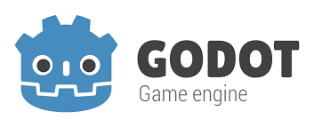

## Hi, there 🖐👋🖐 Am denoms

### About Me
> currently a student of Computer Science & Information Technology
> curious and interested in everything tech from hardware to software
> On the side Am an indie game dev and a 3d generalist

> I do like bots

### Stack
#### Mobile App dev
 

#### Web App dev
    

#### Backend platforms
  

#### Game dev
   

#### Works
links to the sites coming soon

<!--
**botdenoms/botdenoms** is a ✨ _special_ ✨ repository because its `README.md` (this file) appears on your GitHub profile.

Here are some ideas to get you started:svelte

- 🔭 I’m currently working on ...
- 🌱 I’m currently learning ...
- 👯 I’m looking to collaborate on ...
- 🤔 I’m looking for help with ...
- 💬 Ask me about ...
- 📫 How to reach me: ...
- 😄 Pronouns: ...
- ⚡ Fun fact: ...
-->
